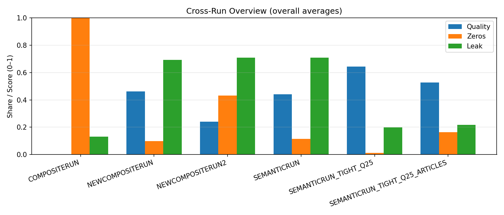
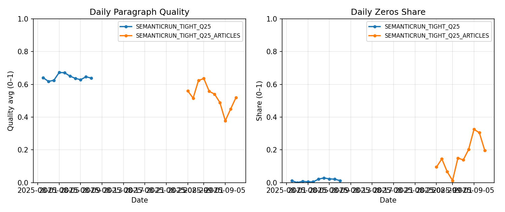

# Varro: Shaping a Small World Model via a Daily Forecasting Loop

## Abstract
A daily evaluative loop can shape a small model’s internal world knowledge by repeatedly exposing it to event→consequence patterns and updating on measurable outcomes (conceptually akin to learned latent dynamics in world‑model RL [9,10]). We use structure as a prior to compress forecast content into a learnable format, and employ deterministic evaluation with group‑wise normalization to produce dense, low‑variance reward signals. This recipe—structure as prior, entropy control via tight decoding [7], and deterministic evaluation—reliably improves specificity and format adherence. To convert these gains into forecasting claims, we next add calibrated outcome scoring and fixed‑panel A/B tests.

## 1. Introduction
This paper introduces Varro, a system that trains a small language model to be a specialized financial forecasting assistant. The core contribution is not a model that can "beat the market," but rather a robust **methodology** for continuously adapting a model in a complex, adversarial, and mercurial domain. The primary hypothesis is that a daily cycle of prediction and feedback can progressively cultivate a richer, more accurate "world model" within a small, specialized AI.

This approach is interesting for several reasons:
- **Continual Learning in an Adversarial Domain:** It transforms the dynamic news environment into a practical, daily RL problem.
- **Structure as a Prior:** It uses a structured forecast format as an inductive bias, compressing the complexity of "world dynamics" into a learnable action space.
- **A Habit of Measurement:** The daily loop produces a constant stream of internal quality metrics, enabling trend tracking, A/B testing, and rapid iteration.

### Related Work
Preference‑based fine‑tuning and RLHF demonstrate that reliable supervision and preference aggregation can align language models with desired behavior [1–6]. World‑model RL shows how learned latent dynamics support sample‑efficient planning and continual updates [9,10]. Using LLMs as judges can provide scalable supervision but introduces bias/sensitivity concerns; we therefore combine careful prompting with deterministic extraction and a semantic fallback [11,12]. Forecasting from news/text has a long literature in finance; our contribution is to turn it into a daily evaluative loop with explicit falsifiability [15,16].

## 2. Methodology: A System for Continual Learning
The Varro system is designed to create a tight feedback loop between the model's predictions and real-world events.

#### 2.1. The Daily RLHF Loop
The system operates on a three-phase daily cycle:
- **Morning (Forecast):** The model generates multiple paragraph-based forecasts for each of the day's news headlines.
- **Evening (Evaluate):** The previous day's forecasts are evaluated against the headlines from the current day. A ranking of the forecasts is produced using a combination of LLM‑based comparison and a deterministic semantic similarity fallback (TF‑IDF/cosine) [8].
- **Night (Train):** The rankings are converted into a reward signal, and the model is fine-tuned using a policy gradient method (GSPO).

#### 2.2. Mechanisms for World Model Shaping
Several specific design choices enable the model to learn effectively:
- **Structural Prior:** The paragraph prompt format narrows the model’s action space, forcing it to focus on generating causally relevant content.
- **Dense Rewards & Label‑Noise Control:** To create a smooth, learnable signal, we use within‑group normalization (ranking rollouts against each other). The evaluation itself is made more reliable by using an LLM for simple comparative judgments with deterministic extraction and a semantic fallback [8], in the spirit of preference‑based training’s emphasis on supervision quality [1–6]. This control over label noise is more critical than minor optimizer tweaks.
- **Entropy Control:** Tight decoding (low‑entropy sampling) reduces degenerate modes and narrows failure tails, improving average quality at small scale [7].
- **Daily Nonstationarity:** The ever-changing news cycle forces the model to continuously update its beliefs, preventing it from simply memorizing static knowledge.

## 3. Results: Key Findings to Date
Our experiments, summarized in the table below, yield several clear conclusions about the effectiveness of different strategies on internal quality metrics.

| Experiment Run                  | Avg. Quality ↑ [^quality] | Zeros Share ↓ [^zeros] | Leak Share ↓ [^leak] |
|-----------------------------------|----------------|-----------------|-----------------|
| **Best (Headline-Only)** `SEMANTICRUN_TIGHT_Q25` | **0.64**      | **0.01**        | **0.19**       |
| **Article-Aware** `SEMANTICRUN_TIGHT_Q25_ARTICLES`    | 0.53      | 0.16        | 0.21       |
| Baseline `NEWCOMPOSITERUN`      | 0.47      | 0.10        | 0.69       |
| Baseline `SEMANTICRUN`      | 0.45      | 0.10        | 0.70       |
| Baseline `NEWCOMPOSITERUN2`      | 0.26      | 0.39        | 0.71       |

[^quality]: Evaluator-derived paragraph quality (0–1) using a rubric emphasizing specificity, falsifiability, timeframe, readability; see reports/METRICS.md.

[^zeros]: Share of evaluated items with invalid/degenerate outputs (e.g., extraction failed). Lower is better; see reports/METRICS.md.

[^leak]: Heuristic hygiene flag that detects instruction/meta echoes; conservative, used for trend/ordering rather than absolute claims; see reports/METRICS.md.

### Figure 1 — Cross‑Run Overview

Figure 1. Cross‑run overview (overall averages) comparing paragraph and one‑line recipes. Paragraph + tight decoding + Q≈0.25 yields the highest quality with minimal zeros and substantially lower leak; article‑aware regresses without better coverage and hygiene.

### Figure 2 — Article‑Aware Validation

Figure 2. Article‑aware prompting (orange) completed end‑to‑end but did not beat the headline‑only tight baseline (blue); zeros increased and quality decreased. Diagnostics point to partial excerpt coverage and scaffold echoes as primary causes.

1.  **Paragraphs with Tight Decoding are a Reliable Recipe:** As shown in the table, the **`SEMANTICRUN_TIGHT_Q25`** run consistently outperforms the baseline runs across all metrics. It achieves the highest average quality (~0.64), the lowest share of zero-quality forecasts (~1%), and a significantly lower share of prompt leakage (~19%) compared to other headline-only methods.

2.  **Validity Starvation is Real:** Earlier experiments with rigid, one-line schemas (not shown) had near-100% failure rates, which stalled the learning process entirely. This confirms that without a validator-assisted decoding method, flexible output formats are essential for small models.

3.  **Article Context is Not a Free Lunch:** The **`SEMANTICRUN_TIGHT_Q25_ARTICLES`** run, which added article context, shows a degradation in performance compared to the best headline-only run. Average quality dropped from 0.64 to 0.53, and the share of zero-quality forecasts increased from 1% to 16%. This illustrates that simply adding more information can be counterproductive without stricter data hygiene to handle it.

## 4. Discussion

#### 4.1. Future Potential: Towards a Specialized World Model
The Varro methodology points to a future of continual, domain-targeted adaptation for AI.
- **Slow World-Model Growth:** Repeated exposure to `headline → outcome` pairs can reinforce the model’s latent understanding of causal edges.
- **Continual Adaptation:** A small model in a daily evaluative loop can potentially track "regime shifts" in its domain far more effectively than a static model.
- **A Scalable Recipe:** The core pattern of `structure as prior + entropy control + deterministic evaluation` appears to be a portable recipe for shaping models in other complex domains.

#### 4.2. Risks, Limitations, and Counterpoints
It is critical to acknowledge the risks of this approach:
- **Goodhart's Law:** Optimizing for internal quality metrics without ensuring they correlate with real-world outcome accuracy can create an illusion of progress [13,14].
- **LLM‑as‑judge reliability:** LLM evaluators can correlate with human judgments in some domains but are sensitive to prompt/context and subject to bias/attacks; we therefore use deterministic extraction and a semantic fallback [11,12].
- **Hygiene Misalignment:** The penalties for prompt-leaking are not yet fully integrated into the primary reward signal, which could distort what the model learns.
- **Reproducibility:** The use of unpinned dependencies or external models for evaluation can weaken the causal claims about why the model’s behavior changes over time.

## 5. Conclusion and Next Steps
We have demonstrated a robust methodology for continuously training a small, specialized language model in a dynamic and adversarial domain. The core contribution is the system itself, which shows that the right combination of structural priors, entropy control, and deterministic evaluation can reliably shape a model's behavior.

However, to make the claim that the model’s internal *world model* is improving, and not just its stylistic output, the following next steps are required:
1.  **Ground in Real-World Outcomes:** We must move beyond internal quality metrics and introduce calibrated 0-10 outcome scores, tracking hit-rates for direction and magnitude on specific asset proxies.
2.  **Conduct Fixed-Panel A/B Tests:** To properly attribute changes in performance to specific model updates, we must evaluate new checkpoints against a fixed, unchanged panel of headlines.
3.  **Align Hygiene and Rewards:** The cleaning process that removes "scaffolding echoes" must be integrated directly into the reward calculation.

## Appendix: Locating Data and Models
All data, models, and reports for this project are stored in a structured format. The `DATA_INVENTORY.md` file in the `/paper` directory provides a detailed map.
- **Primary Data Storage:** `timestamped_storage_<RUN_SUFFIX>/`
- **Model Checkpoints:** `training/checkpoints/gspo_<RUN_SUFFIX>/`
- **Cross-Run Analysis:** `reports/`

## References

[1] Christiano, P. et al. (2017). Deep Reinforcement Learning from Human Preferences. NeurIPS.

[2] Ziegler, D. et al. (2019). Fine‑Tuning Language Models from Human Preferences. NeurIPS.

[3] Stiennon, N. et al. (2020). Learning to Summarize with Human Feedback. NeurIPS.

[4] Ouyang, L. et al. (2022). Training language models to follow instructions with human feedback. arXiv:2203.02155.

[5] Rafailov, R. et al. (2023). Direct Preference Optimization: Your Language Model is Secretly a Reward Model. NeurIPS.

[6] Bai, Y. et al. (2022). Constitutional AI: Harmlessness from AI Feedback. arXiv:2212.08073.

[7] Holtzman, A. et al. (2020). The Curious Case of Neural Text Degeneration. ICLR.

[8] Salton, G.; Buckley, C. (1988). Term‑Weighting Approaches in Automatic Text Retrieval. Information Processing & Management.

[9] Ha, D.; Schmidhuber, J. (2018). World Models. arXiv:1803.10122.

[10] Hafner, D. et al. (2020). Dreamer: Reinforcement Learning with World Models. arXiv:1912.01603.

[11] Kocmi, T.; Federmann, C. (2023). Large Language Models are State‑of‑the‑Art Evaluators of Translation Quality. arXiv:2302.14520.

[12] Wang, X. et al. (2023). Is ChatGPT a Good Judge? Rethinking the Evaluation of LLMs as Judges. arXiv:2306.05685.

[13] Goodhart, C. (1975). Problems of Monetary Management: The U.K. Experience. Papers in Monetary Economics.

[14] Manheim, D.; Garrabrant, S. (2018). Categorizing variants of Goodhart’s Law. arXiv:1803.04585.

[15] Tetlock, P. (2007). Giving Content to Investor Sentiment: The Role of Media in the Stock Market. Journal of Finance.

[16] Loughran, T.; McDonald, B. (2011). When Is a Liability Not a Liability? Textual Analysis, Dictionaries, and 10‑Ks. Journal of Finance.
